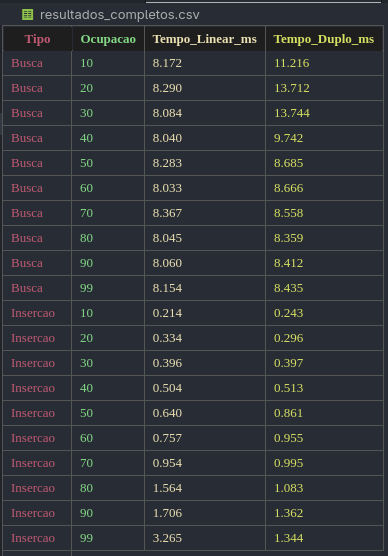

# Testes comparativos entre hash duplo e hash simples em uma base de dados de CEPs

## Projeto desenvolvido por:
- [Júlia Campos](https://github.com/juliacamposn)

## 🎯 Objetivo

O principal objetivo deste trabalho é realizar testes comparativos de desempenho entre o **Hash Simples (Sondagem Linear)** e o **Hash Duplo**. A análise foi feita utilizando uma base de dados real com mais de 1 milhão de CEPs do Brasil, focando em métricas como tempo de busca e sobrecarga (overhead) de inserção em uma estrutura de dados dinâmica.
Durante o percurso de desenvolvimento aprendi muito sobre a implementação de um hash de maneiras diferentes e principalmente situação que são mais adequadas ao hash de sondagem linear do que ao hash duplo.

## ✨ Funcionalidades

- Tabela Hash Flexível: Suporte para Hash Simples e Hash Duplo.
- Redimensionamento Dinâmico: A tabela cresce automaticamente (duplica de tamanho) ao atingir uma taxa de ocupação pré-definida, garantindo eficiência contínua.
- Busca Inteligente: Implementação de uma função que retorna a cidade e o estado correspondentes aos 5 primeiros dígitos de um CEP.
- Análise de Performance: Medição de tempo de execução com gprof para diferentes cenários.

## 🛠️ Tecnologias Utilizadas

- Linguagem de Programação: C/C++

- Ferramenta de Profiling: gprof

- Base de Dados: Lista de CEPs do Brasil (Kaggle)

- Visualização de Dados: CSV

## 🏗️ Construção do código
Na construção do código foi utilizado uma tabela hash genérica com suporte para dois métodos de resolução de colisão: sondagem linear (LINEAR_PROBING) e hash duplo (DOUBLE_HASHING), definidos pelo tipo HashType, uma struct.
Os principais pontos foram:
- A estrutura thash armazena a tabela, tamanho, função de chave, tipo de hash e fator de carga.
- A função hash_insere insere elementos, redimensionando a tabela automaticamente quando o limite de ocupação é atingido.
- A busca e remoção são feitas por sondagem linear ou hash duplo, dependendo do tipo escolhido na construção da tabela.
- O hash principal usa uma variação do MurmurHash, e o segundo hash (para hash duplo) usa um valor primo próximo ao tamanho da tabela.
- Os dados armazenados são structs tcep_info com prefixo do CEP, cidade e estado.

## 📈 Resultados
No arquivo resultados_completos.csv encontra-se os resultados obtidos e as comparações de tempo entre hash simples e o duplo. Na análise mostra como o tempo de busca e inserção é impactado pela taxa de ocupação da tabela para os dois métodos de tratamento de colisão. Foram criadas funções específicas para buscar em uma tabela hash com ocupação de 10% até 99%. Na inserção, para a comparação de tempo foi usada de uma tabela com 6100 buckets iniciais  e com 1000 buckets iniciais inserindo todas as cidades, o tempo de execução foi medido com gprof.
